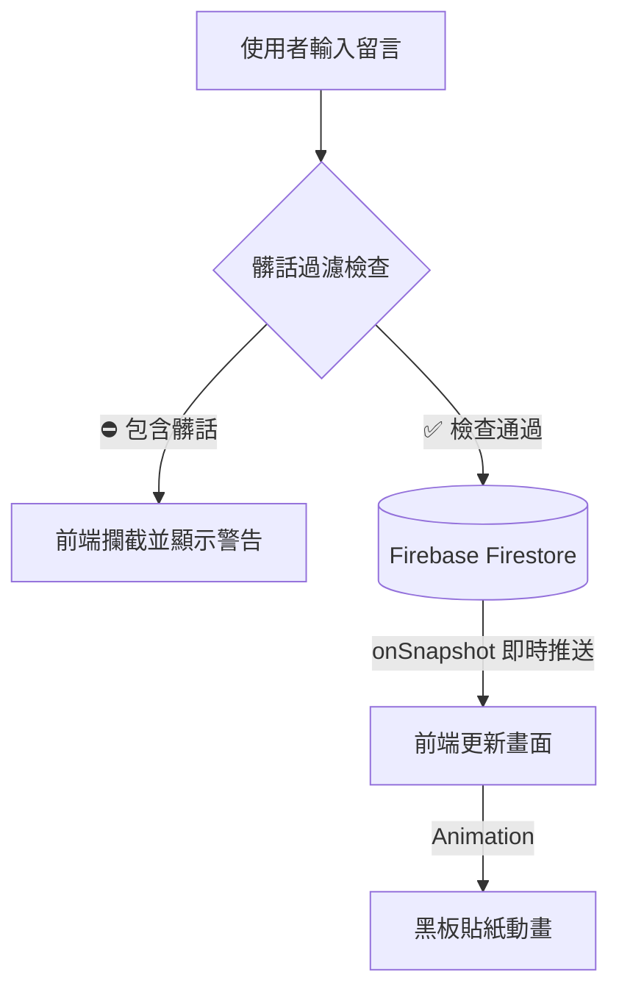
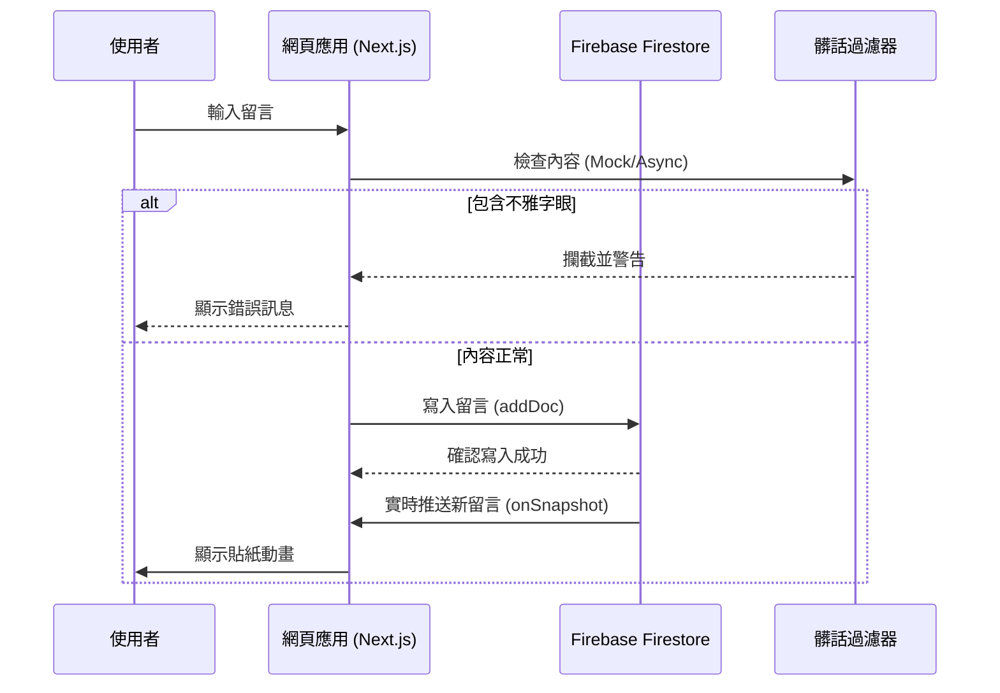

# 網路留言板 (NCUE 104 級畢業典禮留言板 重製版)

## 📌 專案背景 (Project Background)

本專案的前身為 **國立彰化師範大學 104 級畢業典禮 (2015)** 當時所使用的現場互動裝置系統。
當年的典禮主題為「擁抱未來」，為了讓無法上台的親友與師生也能即時傳遞祝福，特別設計了這套「互動式祝福」活動。在典禮尾聲，現場開放同學們透過簡訊傳送祝福，並即時投影於舞台大螢幕上，搭配熱音社的現場演出，將畢業氣氛推向最高潮。

隨著技術的演進，本專案將當年的 **簡訊/APP 轉發架構**，重構為現代化的 **Web-based 架構**，以此紀念當年的畢業回憶，並作為現代 Web 前端技術的實踐範例。

---

## 🏗️ 架構比較 (Architecture Comparison)
### 系統運作流程 (System Flow)



### 詳細時序圖 (Sequence Diagram)



### 1. 舊版架構 (Legacy Architecture - 2015)
當時行動網路尚未全面普及 (4G剛起步)，且為了整合傳統電信簡訊與大螢幕，架構相當複雜且成本較高：

*   **輸入端**: 用戶使用傳統手機或智慧型手機發送 **SMS 簡訊** 至指定門號 (需付費)。
*   **中繼端 (Relay)**: 現場架設一台安裝了客製化 APP 的 Android 手機接收簡訊，APP 攔截簡訊內容後，透過 Parse Client 轉發至後端。
*   **後端**: 使用 Parse.com (BaaS) 託管資料庫。
*   **顯示端**: 前端網頁不斷輪詢 (Polling) 資料庫，並使用 jQuery 呈現簡單的貼圖動畫。

### 2. 現代版架構 (Modern Architecture - 2025)
完全採用 Web 技術重寫，去除了對電信商與實體中繼硬體的依賴，實現真正的即時互動：

*   **輸入端**: 用戶直接透過 **Web 網頁介面** (支援 RWD 手機版) 輸入留言 (免費)。
*   **後端**: **Firebase Firestore** (Realtime Database)。
*   **顯示端**: **Next.js (React)** 應用程式，利用 `onSnapshot` 實現毫秒級的即時監聽與顯示。

### 📝 新舊對照表

| 特色 | 舊版 Legacy (2015) | 現代版 Modern (2025) |
| :--- | :--- | :--- |
| **技術堆疊** | jQuery, Parse.com, Java (Android) | Next.js 14, TypeScript, Firebase |
| **輸入方式** | SMS 簡訊 (需電費) | Web 表單 (免費/無門檻) |
| **延遲 (Latency)** | 高 (電信傳輸 + 輪詢) | 極低 (WebSocket 實時監聽) |
| **視覺效果** | 靜態圖片背景 + 簡易動畫 | 復刻黑板材質 + 隨機紙張 + 流暢彈出動畫 |

---

## ✨ 特色功能 (Features)

1.  **原汁原味 (Authentic Experience)**
    *   保留了當年的「黑板」背景與「便利貼」視覺風格。
    *   復刻了「一張張出現」與「隨機旋轉」的經典動態展示邏輯。

2.  **零延遲體驗 (Optimistic UI)**
    *   留言送出時，前端會立即將貼圖「射」到牆上，無需等待伺服器回應，提供極致流暢的互動感。
    *   若因網路問題發送失敗，系統會透過 Toast 訊息優雅地通知用戶，畫面不會卡住。

3.  **洗牌循環邏輯 (Deck Cycle Logic)**
    *   為了讓過去的留言 (回憶) 都有機會被看見，系統採用類似「播放清單」的洗牌邏輯。
    *   所有歷史留言會被放入牌組，隨機播放直到全部播完一輪後，才會重新洗牌循環，確保內容多樣性。

4.  **插隊機制 (Priority Injection)**
    *   當有人發送新留言時，系統會從 Firebase 收到通知，並立即中斷目前的隨機播放。
    *   系統會優先將最新留言「插隊」顯示在畫面上，確保現場互動的即時性與參與感。

---

## 🛠 技術堆疊 (Tech Stack)

*   **框架**: [Next.js 14](https://nextjs.org/) (App Router)
*   **語言**: TypeScript
*   **樣式**: Tailwind CSS, shadcn/ui
*   **資料庫**: Firebase Firestore
*   **狀態管理**: React Hooks (Custom `useBoard` hook)

## 🚀 如何執行 (Getting Started)

### 前置需求
*   Node.js 18+
*   一個已開啟 Firestore 功能的 Firebase 專案

### 安裝步驟
1.  安裝套件
    ```bash
    npm install
    ```

2.  環境變數設定
    複製 `.env.local.example` 為 `.env.local` 並填入你的 Firebase 設定。
    ```bash
    cp .env.local.example .env.local
    ```

3.  啟動開發伺服器
    ```bash
    npm run dev
    ```

開啟瀏覽器訪問 [http://localhost:3000](http://localhost:3000) 即可看到結果。
